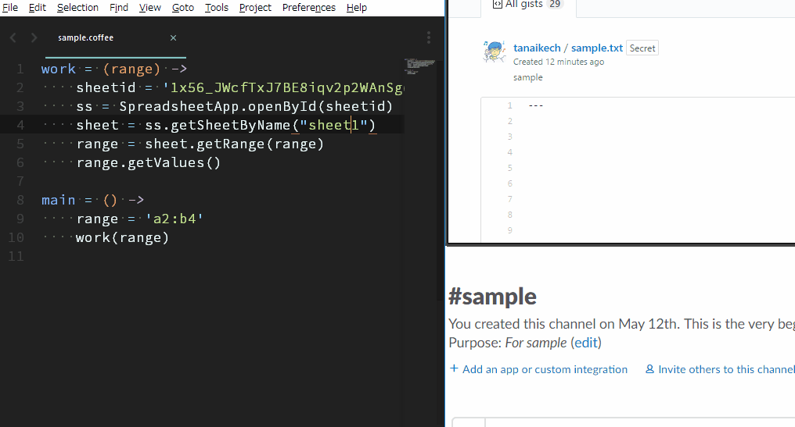

# gislack

[](https://travis-ci.org/tanaikech/gislack)
[](LICENCE)

<a name="top"></a>

# Overview

This is a CLI tool to submit files to both Gist and Slack.

# Description

When I discuss about developing scripts, I often use Slack. When I submitted a script to Slack, I had saved the script to Gist as a backup. I had done manually this on my browser. Namely, I wanted to be saving the revision of script while I'm discussing about the script at Slack. Recently, I wished this process had been able to be automatically run. So I created this tool.

By this, the local environment for developing Google Apps Script (GAS) became more convenient.

# Features of "gislack" are as follows.

1. **Submits files to both Gist and Slack, simultaneously.**

2. **Submits, gets, updates and deletes files for Gist.**

3. **Submits, gets and deletes files for Slack.**

4. **Retrieves access token from client ID and client secret for Gist and Slack.**

# Demo

This is a demonstration for submitting a GAS written by CoffeeScript to both Gist and Slack using Sublime Text. You can confirm that the revision of script uploaded to gist increases. The Google Apps Script is run by [ggsrun](https://github.com/tanaikech/ggsrun).



# How to Install

Download an executable file of gislack from [the release page](https://github.com/tanaikech/gislack/releases) and import to a directory with path.

or

Use go get.

```bash
$ go get -u github.com/tanaikech/gislack
```

If you want to compile this on your PC, please also get a library [https://github.com/tanaikech/getcode](https://github.com/tanaikech/getcode).

## Plugin for Sublime Text

**If you want to use gislack on Sublime Text 3, you can download the plugin for Sublime Text 3 from [https://github.com/tanaikech/gislacks](https://github.com/tanaikech/gislacks)** You can see how to install there.

By using plugin for Sublime Text, you can use gislack as shown at the above demo.

# Retrieve Client ID and Client Secret

In order to use gislack, at first, please retrieve client ID and client secret from GitHub and Slack.

## 1. Gist (GitHub)

1. Login to GitHub.
1. Open **Developer applications** page. [https://github.com/settings/developers](https://github.com/settings/developers)
1. Click **Register new application** button.
1. Input Application name, Homepage URL, Application description, Authorization callback URL. Authorization callback URL is `http://localhost:8080`.
1. After inputted the information, click register application.
1. Copy **Client ID** and **Client Secret**.

## 2. Slack

1. Login to Slack.
1. Open **Your Apps** page. [https://api.slack.com/apps](https://api.slack.com/apps)
1. Click **Create New App** button.
1. Input App Name and Development Slack Team.
1. After inputted the information, click Create App.
1. Click **OAuth & Permissions** at left side or **Permissions** at Add features and functionality.
1. Click **Add a new Redirect URL**.
1. Input `http://localhost:8080` as a new Redirect URL.
1. Click Save URLs
1. Click **Basic Information** at left side.
1. Copy **Client ID** and **Client Secret** at App Credentials. When you see Client Secret, click the show button.

---

# Plugin for Sublime Text?

If you want to submit your scripts developing on Sublime Text to Gist and Slack, you can use plugin for Sublime Text. Please check [https://github.com/tanaikech/gislacks](https://github.com/tanaikech/gislacks).

If you have already had client ID and client secret for both, you can submit your script using Sublime Text soon.

---

# Usage

Following explanations are for terminal base. <u>In order to prevent miss for using shortcuts, the delete commands cannot be used at Sublime Text.</u>

## Authorization

In order to use Gist and Slack, at first, please retrieve access token as following flow.

1. Launch your terminal.
1. Run following code. Please run following commands for GitHub and Slack.

**For GitHub**

```bash
$ gislack auth -gi [client ID of GitHub] -gs [client secret of Github]
```

**For Slack**

```bash
$ gislack auth -si [client ID of Slack] -ss [client secret of Slack]
```

Following flow is the same to GitHub and Slack.

- When above is run, your browser is launched and waits for login to GitHub (or Slack).
- Please login to GitHub (or Slack).
- It opens authorization page. If the authorization button appears, please authorize it. If the button cannot be seen, a page with authorization code is opened.
- The authorization code can be retrieved automatically. And `Done`. is displayed on your terminal.
  - If your browser isn't launched or spends for 30 seconds from the wait of authorization, it becomes the input work queue. This is a manual mode. Please copy displayed URL and paste it to your browser, and login to GitHub (or Slack). A code is displayed on the browser. Please copy it and paste it to your terminal during the input work queue. If you cannot find the code on your browser, please check the URL of your browser.
- When `Done` is displayed on your terminal, the authorization is completed and `gislack.cfg` is created on a directory you currently stay. (If you set `cfgdirectory` as an option, `gislack.cfg` is created to the directory set by `cfgdirectory`.)
- The priority of directory for `gislack.cfg` is as follows.
  1. Option `--cfgdirectory=#####` or `-cfgdir #####`.
  1. Environment variable : `GISLACK_CFG_PATH` (For example, you can write this for `.bashrc` as `export GISLACK_CFG_PATH=#####`.)
  1. Current working directory.

Retrieved access tokens from GitHub and Slack have no limitation time. So the authorization process is only one time.

**Congratulation! Here, the preparation for using gislack was completed.**

## Double Submission

<a name="Double_Submission"></a>

### New Submission for Slack and Gist

Following command submits both Gist and Slack, simultaneously

```
$ gislack d -f [file] \
            -fn [filename] \
            -t [title] \
            -p \
            -ft [file type for Slack(e.g. javascript)] \
            -ch [channel for Slack(e.g. general)] \
            -ic [initial comment for Slack]
```

- `-f` : A file for submitting.
- `-fn` : File name on Gist. **If this is not used, it's no problem.** If this is not used, the file name is used as the file name of submitted file.
- `-t` : Title on Gist and Slack.
- `-p` : This is a boolean. If you want to submit as a public for Gist, please use this. If you use `-p`, the file is submitted as a secret.
- `-ft` : File type for submitting. (e.g. javascript) If you don't use this, the file type is decided from the submitted file. If the extension is `.js`, it judges as Javascript. **If this is not used, it's no problem.**
- `-ch` : Channel name for Slack. (e.g. general) You are not necessary to use "#" for channel name.
- `-ic` : You can give initial comment using this. **If this is not used, it's no problem.**

### New Submission for Slack and Submission with Revision for Gist

**When you want to use this command, at first, please run above "New Submission for Slack and Gist" and retrieve Gist ID.** At the plugin of Sublime Text, these are automatically run.

```
$ gislack d -uo or -ua [Gist ID]
            -f [file] \
            -fn [filename] \
            -t [title] \
            -p \
            -ft [file type for Slack(e.g. javascript)] \
            -ch [channel for Slack(e.g. general)] \
            -ic [initial comment for Slack]
```

- `-uo` : Updated by overwriting a file. In this case, you can see the history of a file. This is the same to above demo.
- `-ua` : Updated by adding a file. In this case, you can see increasing files.

## For Gist

### 1. Submit to Gist

```
$ gislack g -f [files] -t [title] -fn [filename] -p
```

- `--anonymous` : If you want to submit as `Anonymous`, please use this option.
- `-f` : You can submit several files as a gist. For example,
  - `$ gislack g -f file1.js,file2.js,file3.html -t sample -fn sample1.js,sample2.js,sample3.html -p`
  - At above sample, when options `-f` and `-fn` has the same number of file name, file1.js, file2.js and file3.html are used sample1.js, sample2.js and sample3.html as file name, respectively.

**When file is submitted as Anonymous, it cannot be deleted. So please be careful.**

The detail explanation of options are as shown [here](#Double_Submission).

### 2. Update Gist as Overwriting

```
$ gislack g -uo [Gist ID] f [file] -t [title] -fn [filename] -p
```

The detail explanation of options are as shown [here](#Double_Submission).

### 3. Update Gist as Adding

```
$ gislack g -ua [Gist ID] f [file] -t [title] -fn [filename] -p
```

The detail explanation of options are as shown [here](#Double_Submission).

### 4. Get Gist List

```
$ gislack g -l
```

- `-l` : Get gist list.

### 5. Get Gist

```
$ gislack g -g [Gist ID]
```

- `-l` : Get gist. This is for retrieving the latest gist from gist ID.

### 6. Get Gist's History

```
$ gislack g -gh [Gist ID]
```

- `-gv` : Get gist's history. This is for retrieving a version list.

### 7. Get Gist's Version

```
$ gislack g -gv [URL for a version]
```

- `-gv` : Get gist's version. This is for retrieving file at the version from the history. The value of `[URL for a version]` can be retrieved by the option `-gv`. When this is used, at first, please run "Get Gist's History" and retrieve "URL for a version".

### 8. Delete Gist

```
$ gislack g -d [Gist ID]
```

- `-dv` : Delete a gist of gist ID.

### 9. Delete All Gists

```
$ gislack g --deleteall
```

- `--deleteall` : Delete all gists from your account. When this is used, gislack shows a message for confirming this. When you put "y", this is run.

**When you use this option, please be careful.**

## For Slack

### 1. Submit to Slack

Following command is for submitting a file.

```
$ gislack s -f [file] -ti [title] -ch [channel] -ft [file type] -ic [initial comment]
```

Following command is for submitting data directly inputted strings to the command.

```
$ gislack s -co [strings] -ti [title] -ch [channel] -ft [file type] -ic [initial comment]
```

- `-co` : You can input directly strings to command line using this option.

The detail explanation of options are as shown [here](#Double_Submission).

### 2. Get File List

```
$ gislack s -fl
```

- `-fl` : Get file list on Slack Team you registered.

### 3. Get File

```
$ gislack s -gf [File ID]
```

- `-gf` : Get a file using file ID. The file ID can be retrieved using "Get File List".

### 4. Delete File

```
$ gislack s -df [File ID]
```

- `-df` : Delete a file. The file ID can be retrieved from "Get File". If you are not owner of the team, you can delete only a file that you submitted.

### 5. Delete All files

```
$ gislack s -dfs
```

- `-dfs` : Delete all files. If you are owner, by this command, all files are deleted.

**When you use this, please be careful.**

### 6. Get Channel History

```
$ gislack s -hi -ch [Channel name]
```

- `-gf` : Get channel history.

### 7. Delete History

```
$ gislack s -dh [History ID] -ch [Channel name]
```

- `-dh` : Delete a history. The history ID can be retrieved from "Get Channel History". If you are not owner of the team, you can delete only a file that you submitted.

### 8. Delete All Histories

```
$ gislack s -dhs [Number of histories you want to delete. Max is 50.] -ch [Channel name]
```

- `-dhs` : Delete all histories. But the MAX is 50. If the channel has a lot of histories over 50, please use this command repeatedly, because of the limitation for using APIs. If you are owner, by this command, all histories are deleted.

**When you use this, please be careful.**

# References

## APIs

- Gist API document [https://developer.github.com/v3/gists/](https://developer.github.com/v3/gists/)
- Slack API document [https://api.slack.com/methods](https://api.slack.com/methods)

## Controlling gislack by JSON

gislack can be controlled by JSON data. Using this, gislack may be used except for Sublime Text. The parameters for JSON can be seen at `useJSON()` in `handler.go` on [https://github.com/tanaikech/gislack](https://github.com/tanaikech/gislack).

<a name="Update_History"></a>

# Update History

- v1.0.0 (June 22, 2017)

  Initial release.

- v1.0.1 (June 30, 2017)

  Some modifications related to error handling.

- v1.0.2 (June 30, 2017)

  Some modifications related to displaying results.

<a name="v103"></a>

- v1.0.3 (January 3, 2020)

  1. It seems that the specification of `github.com/urfave/cli` was changed by the update of [https://github.com/urfave/cli](https://github.com/urfave/cli). By this, when `go get -u github.com/tanaikech/gislack` is run, an error occurred. So this error was removed.

<a name="v104"></a>

- v1.0.4 (February 27, 2021)

  1. I noticed that this application uses the duplicated methods of Slack API. [Ref](https://api.slack.com/methods) By this, the duplicated methods were updated to the new methods as follows.

     - From "channels.list" to "conversations.list".
     - From "channels.history" to "conversations.history".

[TOP](#top)
